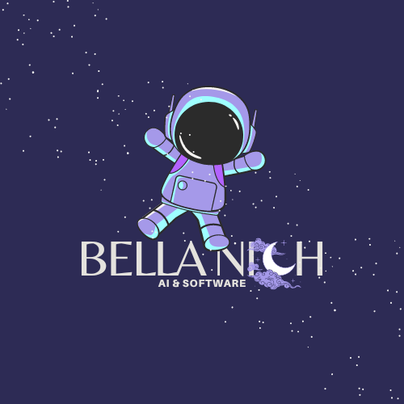

<!-- Source: https://github.com/othneildrew/Best-README-Template/pull/73 -->

<a name="readme-top"></a>


<!-- PROJECT SHIELDS -->
<!--
*** https://www.markdownguide.org/basic-syntax/#reference-style-links
-->
[![Contributors][contributors-shield]][contributors-url]
[![Forks][forks-shield]][forks-url]
[![Stargazers][stars-shield]][stars-url]
[![Issues][issues-shield]][issues-url]
[![MIT License][license-shield]][license-url]
[![LinkedIn][linkedin-shield]][linkedin-url]


<!-- PROJECT LOGO -->
<br />
<div align="center">
  <! -- Uncomment to turn logo image into a link -->
  <!-- <a href="https://github.com/bellanich/python-ml-template">
    
  </a> -->
  

  <h3 align="center"> Python ML Template </h3>

  <p align="center">
    A starter kit for Python-based Machine Learning projects
    <br />
    <a href="https://github.com/bellanich/python-ml-template/tree/main/docs"><strong>Explore the docs »</strong></a>
    <br />
    <br />
    <a href="#usage">View Demo</a>
    ·
    <a href="https://github.com/bellanich/python-ml-template/issues">Report Bug</a>
    ·
    <a href="https://github.com/bellanich/python-ml-template/issues">Request Feature</a>
  </p>
</div>


<!-- TABLE OF CONTENTS -->
<details>
  <summary>Table of Contents</summary>
  <ol>
    <li>
      <a href="#about-the-project">About The Project</a>
      <ul>
         <li><a href="#features">Features</a></li>
         <li><a href="#built-with">Built With</a></li>
      </ul>
    </li>
    <li>
      <a href="#getting-started">Getting Started</a>
      <ul>
        <li><a href="#prerequisites">Prerequisites</a></li>
        <li><a href="#installation">Installation</a></li>
      </ul>
    </li>
    <li><a href="#usage">Usage</a></li>
    <li><a href="#contributing">Contributing</a></li>
    <li><a href="#license">License</a></li>
    <li><a href="#contact">Contact</a></li>
    <li><a href="#acknowledgments">Acknowledgments</a></li>
  </ol>
</details>


<!-- ABOUT THE PROJECT -->
## About The Project

<!-- [![Product Name Screen Shot][product-screenshot]](https://example.com) -->

Launching a new project from scratch can be a challenge, especially with a personal commitment to high-quality work. This initial setup complexity got me thinking: "How few commands can I really get away with to kickstart a new machine learning (ML) project"?

Well, from putting together this Python ML Template project, my answer is three:

```bash
copier copy python-ml-template/ your-new-project
cd your-new-project/
make
```

This even automatically creates a remote repository on GitHub! Of course, this template is doing most of the heavy lifting. For more details on getting started, please Checkout <a href="#getting-started">this README's "Getting Started" section</a>.

<p align="right">(<a href="#readme-top">back to top</a>)</p>

### Features

So, what exactly did I choose to include in my essential starter kit for a Python-based Machine Learning project?

* A **simple continuous integration (CI) pipeline** that blocks any pull requests (PRs) with failing Python tests
* **Dynamic template generation** to encourage a "document as you go" approach rather than hastily throwing everything together
* A **base Python environment definition** so that I'm not consistently reinstalling my favorite Python packages (e.g., `black`) over and over
* Git and GitHub-focused **templates to make version control** and peer-to-peer collaboration as **streamlined** as possible

For a deeper dive of what's included in this project and why, please refer to [the project documentation](https://github.com/bellanich/python-ml-template/tree/main/docs).

<p align="right">(<a href="#readme-top">back to top</a>)</p>


### Built With

This project leverages the power of the following frameworks and libraries. Refer to the acknowledgments section for the other resources that I've employed

* [![Static Badge][copier-badge-url]][copier-website]
* [![Static Badge][pre-commit-badge-url]][pre-commit-website]
* [![Static Badge][conda-badge-url]][conda-website]
* [![Static Badge][pytest-badge-url]][pytest-website]
* [![Static Badge][github-actions-badge-url]][github-actions-website]
* [![Static Badge][github-cli-badge-url]][github-cli-website]

<p align="right">(<a href="#readme-top">back to top</a>)</p>


## Getting Started

Want to get started with ML development as soon as possible? Then just follow the steps outlined below.

### Prerequisites

Make sure you have the following dependencies installed:

* [Conda][link-download-conda] or [miniconda][link-download-miniconda] for Python package management

* [Copier][link-download-copier] for dynamic Markdown file templating

* [GitHub CLI][link-download-github-cli] for automated project publishing and run `gh auth login` to setup

### Installation

Getting started is simple. Here are the step-by-step instructions:

1. Clone this repository (`git clone https://github.com/bellanich/python-ml-template`)
2. Fill out your personal details in the relevant fields of the [copier.yml](./copier.yml) file
3. Use copier to copy this template to a new directory and fill out the provided prompts (`copier copy python-ml-template/ your-new-project/`)
4. Execute the Makefile inside the newly created directory
   ```bash
   cd your-new-project/
   make
   ```
5. Activate your conda environment and you're ready to go
    ```bash
    # By default, your conda env will have the same name as your project
    CONDA_ENV_NAME=$(basename "$(pwd)")
    conda activate $CONDA_ENV_NAME
    ```

<p align="right">(<a href="#readme-top">back to top</a>)</p>


<!-- USAGE EXAMPLES -->
## Usage

Curious how my Python ML Template works? This GIF showcases how you can get started right away with ML feature development by using this template's 3 simple setup commands:

<div align="center">

</div>

<br/>

For more implementation details, please refer to the [project documentation](docs/0_overview.md).


> **_NOTE:_** This section focus is illustrating a project's business value. Therefore, in a more prototypical ML project, you would also include things like screenshots, code examples, and figures.

<p align="right">(<a href="#readme-top">back to top</a>)</p>


<!-- CONTRIBUTING -->
## Contributing

If you have a suggestion that would make this project better, please fork this repository and create a pull request. You can also simply open an issue with the tag "enhancement".

1. Fork the Project
2. Create your Feature Branch (`git checkout -b feature/AmazingFeature`)
3. Commit your Changes (`git commit -m 'Add some AmazingFeature'`)
4. Push to the Branch (`git push origin feature/AmazingFeature`)
5. Open a Pull Request

<p align="right">(<a href="#readme-top">back to top</a>)</p>


<!-- LICENSE -->
## License

Distributed under the MIT License. See `LICENSE` file for more information.

<p align="right">(<a href="#readme-top">back to top</a>)</p>


<!-- CONTACT -->
## Contact

<!-- Bella Nicholson - [@your_twitter](https://twitter.com/your_username) - email@example.com -->

Bella Nicholson - [@bella-nicholson](https://www.linkedin.com/in/bella-nicholson/) - bellanich.software@gmail.com

Project Link: [https://github.com/bellanich/python-ml-template](https://github.com/bellanich/python-ml-template)


<p align="right">(<a href="#readme-top">back to top</a>)</p>


<!-- ACKNOWLEDGMENTS -->
## Acknowledgments

Rather than re-inventing the wheel, I've leveraged the following great resources in my template formulation:

<!-- Here are the sources that I used to formulate this template repository: -->

* [The Best README Template by Othneil Drew](https://github.com/othneildrew/Best-README-Template)
* [Axolo's Guide to GitHub PR Templates](https://axolo.co/blog/p/part-3-github-pull-request-template)
* [Collection of GitHub Issues Templates by Steve Mao](https://github.com/stevemao/github-issue-templates)
* [Collection of Git Attribute Templates](https://github.com/gitattributes/gitattributes) [by gitattributes](https://github.com/orgs/gitattributes/people)
* [Shields.io Static Badge Builder](https://shields.io/badges/static-badge)
* [Guide to making custom language badges](https://javascript.plainenglish.io/how-to-make-custom-language-badges-for-your-profile-using-shields-io-d2aeaf016b6b)
* [Terminalizer by Mohammad Anas Fares for terminal session recording](https://www.terminalizer.com)
* [Simple Icons's library of open source project logos](https://simpleicons.org/)
* [Python's Official Logging Cookbook by Vinay Sajip](https://docs.python.org/3/howto/logging-cookbook.html)
* [Conventional Commit Regex by marcojahn](https://gist.github.com/marcojahn/482410b728c31b221b70ea6d2c433f0c)

<!-- * [GitHub Emoji Cheat Sheet](https://www.webpagefx.com/tools/emoji-cheat-sheet)
* [Malven's Flexbox Cheatsheet](https://flexbox.malven.co/)
* [Malven's Grid Cheatsheet](https://grid.malven.co/)
* [Img Shields](https://shields.io)
* [GitHub Pages](https://pages.github.com)
* [Font Awesome](https://fontawesome.com)
* [React Icons](https://react-icons.github.io/react-icons/search) -->

<p align="right">(<a href="#readme-top">back to top</a>)</p>


<!-- END OF PAGE BUTTONS -->
<div align="center">
  <p align="right">
    <a href="docs/0_overview.md" style="text-align: right;">Next Page &rightarrow; </a>
  </p>
</div>


<!-- MARKDOWN LINKS & IMAGES -->
<!-- https://www.markdownguide.org/basic-syntax/#reference-style-links -->
[contributors-shield]: https://img.shields.io/github/contributors/bellanich/python-ml-template.svg?style=for-the-badge
[contributors-url]: https://github.com/bellanich/python-ml-template/graphs/contributors
[forks-shield]: https://img.shields.io/github/forks/bellanich/python-ml-template.svg?style=for-the-badge
[forks-url]: https://github.com/bellanich/python-ml-template/network/members
[stars-shield]: https://img.shields.io/github/stars/bellanich/python-ml-template.svg?style=for-the-badge
[stars-url]: https://github.com/bellanich/python-ml-template/stargazers
[issues-shield]: https://img.shields.io/github/issues/bellanich/python-ml-template.svg?style=for-the-badge
[issues-url]: https://github.com/bellanich/python-ml-template/issues
[license-shield]: https://img.shields.io/github/license/bellanich/python-ml-template?label=license&style=for-the-badge
[license-url]: https://github.com/bellanich/python-ml-template/blob/master/LICENSE.txt
[linkedin-shield]: https://img.shields.io/badge/-LinkedIn-black.svg?style=for-the-badge&logo=linkedin&colorB=555
[linkedin-url]: https://www.linkedin.com/in/bella-nicholson/
[product-screenshot]: images/screenshot.png
<!-- Badges for tooling and frameworks  -->
[pre-commit-badge-url]: https://img.shields.io/badge/-React%2520Router?style=for-the-badge&logo=precommit&logoColor=%23FAB040&label=precommit&color=gray&link=https%3A%2F%2Fpre-commit.com
[pre-commit-website]: https://pre-commit.com
[copier-badge-url]: https://img.shields.io/badge/-React%2520Router?style=for-the-badge&logo=python&logoColor=orange&label=copier&labelColor=white&color=white&link=https%3A%2F%2F.js.org%2F%23%2F
[copier-website]: https://copier.readthedocs.io/en/stable/
[pytest-badge-url]: https://img.shields.io/badge/-ReactJS%2520?style=for-the-badge&logo=pytest&logoColor=%230A9EDC&label=PyTest&labelColor=gray&color=gray
[pytest-website]: https://docs.pytest.org/en/7.4.x/contents.html
[github-actions-badge-url]: https://img.shields.io/badge/-ReactJS%2520?style=for-the-badge&logo=githubactions&logoColor=%232088FF&label=GitHub%20Actions&labelColor=white&color=white
[github-actions-website]: https://docs.github.com/en/actions/learn-github-actions/understanding-github-actions
[link-download-conda]: https://docs.conda.io/projects/conda/en/stable/user-guide/install/download.html
[link-download-miniconda]: https://docs.conda.io/projects/miniconda/en/latest/
[link-download-copier]: https://copier.readthedocs.io/en/stable/#installation
[conda-badge-url]: https://img.shields.io/badge/-React%2520?style=for-the-badge&logo=anaconda&logoColor=%2344A833&label=Anaconda&labelColor=white&color=white
[conda-website]: https://docs.conda.io/en/latest/#
[github-cli-badge-url]: https://img.shields.io/badge/-React%2520Router?style=for-the-badge&logo=github&logoColor=white&label=GitHub%20CLI&labelColor=black&color=black
[github-cli-website]: https://cli.github.com
[link-download-github-cli]: https://cli.github.com/manual/
